# 2025年排名前23的AI日程规划工具汇总(最新整理)

在快节奏的现代生活中,管理时间和任务变得越来越复杂。从连续的会议到突发的截止日期,再到被忽视的个人目标,我们需要更智能的方式来组织日程。AI日程规划工具通过自动化任务分配、智能优先级排序和动态调整计划,帮助你找回对时间的掌控,让每一天都过得高效而从容。

这份汇总收录了市面上最值得关注的AI日程规划和时间管理工具,覆盖个人效率、团队协作、自动化调度等多种场景。无论你是需要深度专注时间的创作者,还是要在多项目间切换的管理者,或是追求工作生活平衡的自由职业者,都能在这里找到适合自己的解决方案。

## **[BeforeSunset AI](https://www.beforesunset.ai)**

专为忙碌专业人士设计的智能日程规划助手,通过AI驱动的调度算法优化你的每一天。

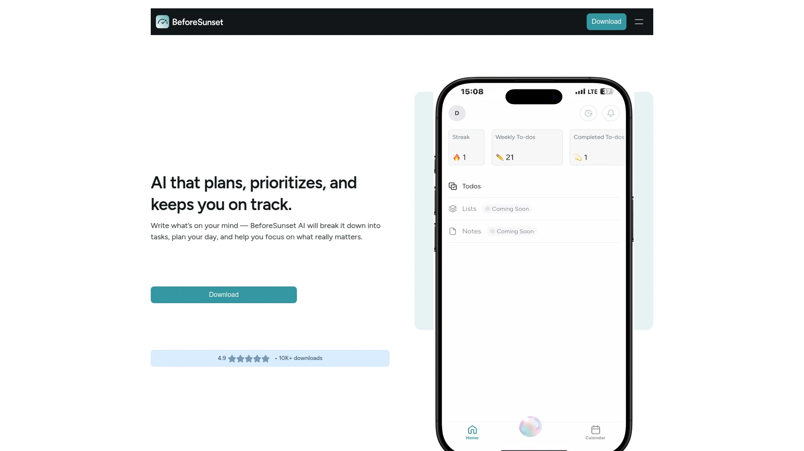

BeforeSunset AI擅长根据你的工作习惯和即将到来的任务,自动建议最佳的会议时间和任务安排。它具备情境感知能力,会考虑地点、通勤时间和任务性质来提供智能调度建议。比如当你有多个不同地点的会议时,系统会自动计算通勤时间,确保你准时到达。

这款工具提供实时协作功能,与Slack和Microsoft Teams等沟通工具深度集成,让团队成员的时间协调变得轻松。智能提醒系统会根据你的日程和偏好进行定制,AI会学习哪些提醒对你最有效,并随时间调整通知策略。

个性化洞察分析是另一大亮点。AI会分析你的生产力模式并提供可操作的改进建议,比如推荐最佳工作时段或识别耗时超预期的任务,帮助你做出数据驱动的决策。平台与Google Calendar、Outlook、Trello和Asana等主流工具无缝集成,确保所有任务和约会跨平台同步。

用户界面简洁直观,即使是数字日历新手也能快速上手。AI持续从你的互动中学习并适应你的变化需求,让日历随时间推移变得越来越精准和实用。通过自动化常规调度任务并提供智能建议,BeforeSunset AI为你释放更多时间用于重要活动。

## **[Motion](https://www.usemotion.com)**

全自动化日程规划专家,从头到尾为你生成个性化日程安排。

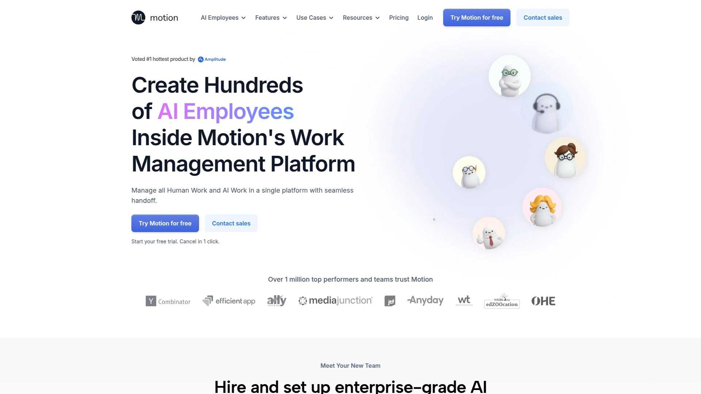

Motion会根据任务的紧急程度、截止日期和专注时间自动将任务、会议和休息时间安排到你的日历中。它擅长为深度工作预留大块时间,插入休息以避免倦怠,并通过将最高效的时段标记为忙碌来保护你免受干扰。

支持使用自然语言添加任务,按项目组织,设置重复日程,几乎不需要手动调整。当冲突或变化发生时,系统会自动重新安排。提供统一的日历视图,集成Google和Outlook。动态每日规划器将任务和事件合并显示,任务拆分功能可以分解复杂任务。

适合愿意将日常计划完全交给自动化的人群,Motion像一个主动的AI助手,确保你的一天保持优化而无需动手。团队功能包括共享日历和工作量管理。个人计划月费34美元,商业计划月费20美元。

虽然自动化程度高可能让手动规划者感到过度控制,且缺乏引导AI规划器何时处理何种任务的方式,但对于追求全自动效率的用户来说,Motion是理想选择。

## **[Reclaim.ai](https://reclaim.ai)**

智能习惯养成和任务防护工具,自动为重要事项预留时间。

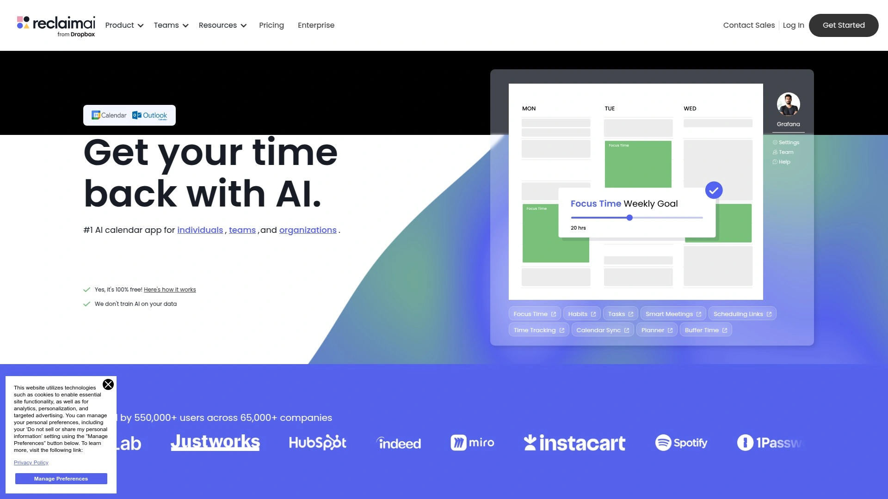

Reclaim.ai直接与Google Calendar集成,根据优先级、截止日期和时间偏好自动为任务和习惯(如锻炼、写日记或午餐)预留时间。当冲突出现时,它会实时自动调整任务。

基于紧急程度和截止日期优先排序任务,提供智能会议协调功能。核心功能有免费计划可用,专业版每月8美元起,团队和企业计划从每用户每月10美元和18美元起。

平台与Asana、ClickUp(通过Zapier)、Google Tasks、Linear、Todoist和Zoom等工具集成。自动重新安排功能确保当你的老板突然安排会议时,日程会自动调整,避免双重预订和压力。

局限性包括仅限Google Calendar,不支持Outlook或iCloud。没有原生移动应用,依赖Google Calendar的移动访问。任务管理功能较为基础,界面实用但视觉效果不如新工具精致。免费计划对可添加的习惯和任务数量有限制,设置需要一些调整。

## **[Morgen](https://www.morgen.so)**

统一日历任务中心,通过AI规划器推荐符合能量水平的时间阻塞日程。

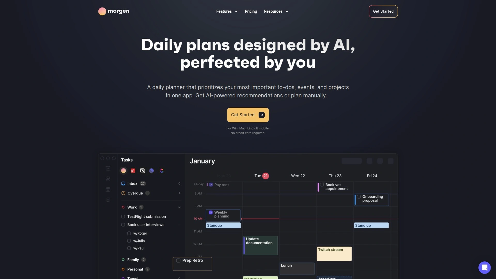

Morgen是日历、任务和调度的一体化中心,像个人助理但没有剪贴板。它从Notion、ClickUp、Obsidian、Todoist等工具中提取任务,让你轻松拖放到日历中,构建既有意图又现实的计划。

智能AI规划器推荐与你能力匹配的能量感知时间阻塞日程。它不只是堆叠任务,而是通过休息时间调整节奏,拆分长时间会话,并在事情变化时建议调整。Frames功能让你可以模板化时间,在一周内分配不同类型的任务,比如早上深度工作、下午快速任务、周二晚上创意时间。

与所有日历集成以统一工作和个人生活(Google、Outlook等)。任务管理集成包括Notion、Todoist等,高级任务优先级排序和筛选。自动添加自定义缓冲时间和通勤时间,可定制的会议调度链接。

跨平台支持Windows、macOS、Linux、iOS和Android。命令栏和快捷键支持快速工作流,注重隐私,Zapier集成扩展工作流。个人计划年付每月15美元,团队计划每席位每月25美元或年付每月10美元。

缺点是尚无网页版,缺乏大型团队的高级协作功能。但对于寻求强大时间阻塞规划器的专业人士和创作者来说,Morgen连接任务和日历而不妨碍你。

## **[Sunsama](https://www.sunsama.com)**

平静专注的每日规划仪式工具,引导你进行正念任务选择。

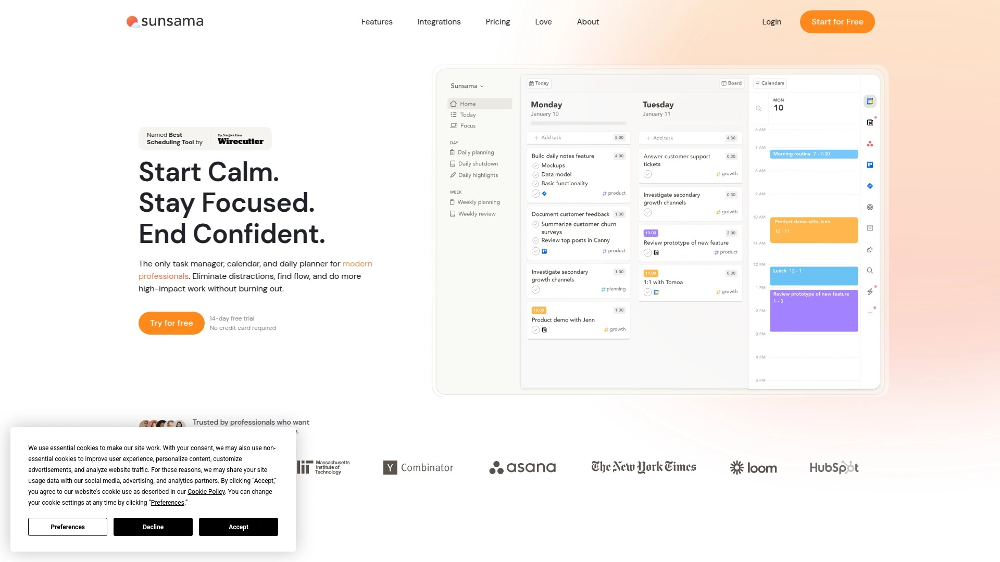

Sunsama每天早晨以引导式规划会话开始,你选择要处理的任务、估计所需时间并决定何时处理。它与Trello、Asana和Gmail等工具集成,将所有内容汇集到一个专注、无干扰的工具中。

这款工具像一个温和的助手,帮助你设定每日目标、用心优先排序并反思进展,让你保持生产力而不会精疲力竭。极简界面和可持续的规划流程非常适合渴望结构但不想要严格自动化压力的人。

与Trello、Asana、Gmail等流行工具集成,清爽平静的用户界面减少认知负担。跨平台可用性覆盖macOS、Windows、网页、iOS和Android。任务同步和日历集成提供统一视图。

提供14天免费试用,月付26美元。需要手动努力规划和调整每天,协作和团队规划功能有限。不太适合高速或反应式工作流。对于喜欢在每天开始时进行深思熟虑规划的用户,Sunsama提供了一种更有意识的方式来管理时间。

## **[Trevor AI](https://trevorai.com)**

智能极简每日规划助手,将待办清单转化为结构化的时间阻塞日历。

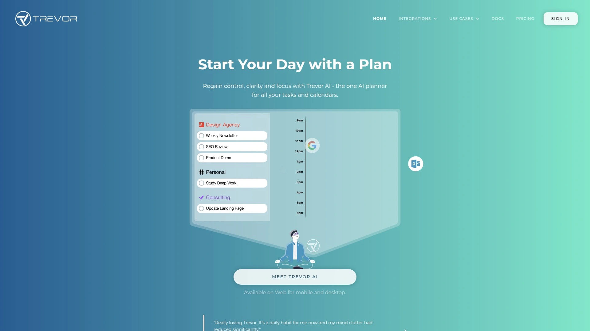

Trevor AI与Google Calendar、Outlook、Todoist和Microsoft To-Do无缝集成,将所有任务和事件汇入统一视图。专注模式是为深度工作而设计,将任务分解为可操作步骤并配合内置计时器帮助你保持专注。

在你规划时,Trevor从你的习惯中学习,提供个性化洞察以改进时间管理方式。无论你喜欢通过拖放进行动手控制,还是让智能调度处理后勤,任务中心都为你提供组织日程的空间。

智能AI调度配合时间阻塞任务规划,与Google Calendar、Outlook、Todoist和Microsoft To-Do集成。专注模式带任务分解和内置计时器用于深度工作,从你的习惯中学习并提供个性化规划洞察。灵活规划同时支持拖放和自动调度,简洁极简界面实现无干扰规划。

通过网页应用提供跨平台支持,免费层级可用,专业版每月6美元起。缺点是目前没有移动应用(仅桌面/网页),协作或团队功能有限。缺乏与流行任务和项目管理工具(Notion、ClickUp等)的原生集成,智能调度建议有用但不如完全自动化AI助手先进。

## **[Akiflow](https://akiflow.com)**

统一收件箱式每日规划助手,整合多平台任务实现快速时间阻塞。

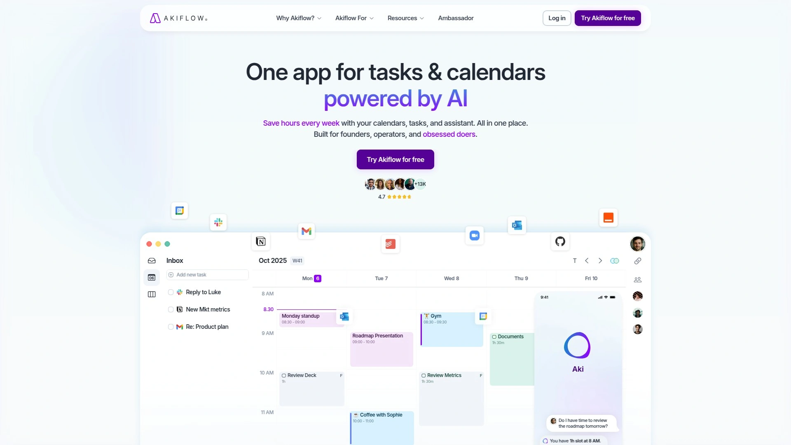

Akiflow旨在通过统一视图帮助你掌控时间,将Gmail、Notion、Todoist或Slack等工具的任务汇集到整合收件箱中,让你在一个地方看到所有任务。从那里可以将任务拖入日历进行时间阻塞。

虽然Akiflow不使用AI自动调度任务,但它通过浮现优先事项并通过键盘快捷键、智能暂停和快速捕获加速工作流,像主动助手一样运作。广泛的集成列表包括Gmail、Slack、Notion、Asana、ClickUp。

统一收件箱用于集中任务捕获,通过拖放进行时间阻塞。智能调度链接方便会议协调,专注计时器实现无干扰深度工作。命令栏和键盘快捷键提升效率,简洁界面,支持离线工作。

可用于macOS、Windows和移动端(测试版),专业计划每月34美元。没有团队共享项目或工作量视图,移动应用仍在测试阶段且缺乏完整功能对等。集成包括Jira、ClickUp、Notion、Asana、Zoom、Trello、Linear和Zapier。

## **[Clockwise](https://www.getclockwise.com)**

智能日历优化器,自动重排事件并为深度工作创造大块不间断时间。

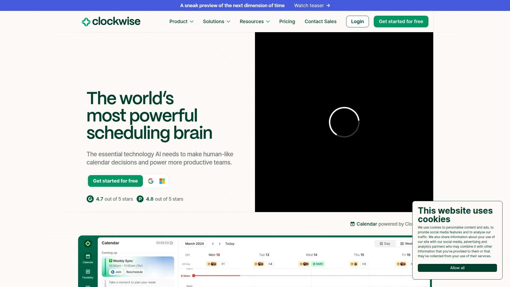

Clockwise与Google Calendar集成并连接Slack和Asana等工具,实时智能管理可用性。专注时间或灵活保留等功能为任务预留空间,智能会议重新安排考虑团队偏好、时区和工作时间。

即使在共享日历洞察、自动午餐保留和揭示时间花费方式的日历分析方面,Clockwise表现更突出。AI日历优化用于深度工作和专注,自动重新安排会议以减少上下文切换。灵活保留为任务和优先事项预留时间,自动创建专注时间块。

团队共享日历,智能会议建议考虑团队偏好和时区,分析追踪时间花费方式。与Google Calendar、Outlook和Slack集成。提供免费层级,团队每用户每月6.75美元,商业计划每月11.50美元,定制企业套餐。

缺点是没有原生任务或待办事项管理,对非会议相关规划的支持有限。对于会议密集的团队和个人,Clockwise通过保护专注时间并优化会议安排来提升生产力。

## **[Amie](https://www.amie.so)**

设计精美的日历待办应用,融合AI会议助手功能。

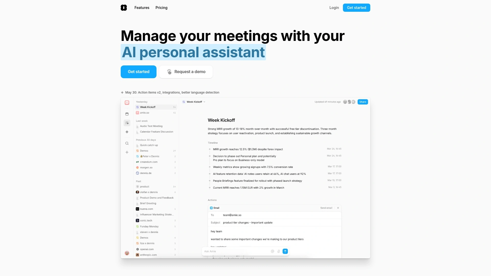

Amie将日历、任务、会议和电子邮件整合到一个简洁界面中。虽然不像Morgen或Motion那样提供完整的AI自动调度,但Amie在帮助你做笔记、录制会议(无需机器人)、总结对话并将其转化为行动项方面表现出色。

结合日历、待办事项和会议于优雅界面,AI摘要理解你的业务背景。原生会议录制无需机器人(跨Zoom、Meet、Teams、Slack)。将任务拖放到日历中进行时间阻塞,自然语言任务和事件输入。

键盘友好的快速用户体验,macOS、Windows和iOS原生应用。Spotify集成让你用音乐规划一天,智能聊天操作可要求重新安排、起草电子邮件、创建思维导图等。与Notion、Slack和Hubspot等工具集成,会议前后尊重隐私的私人笔记。

专业版每月25美元起,商业版每月50美元,企业版定制定价。缺点是没有AI自动调度(如能量感知任务放置)。与Google Calendar、Linear、Outlook、Gmail、Notion、Slack、Hubspot、Pipedrive、Spotify、Skype和Microsoft Teams集成。

## **[SkedPal](https://www.skedpal.com)**

基于优先级的动态任务自动调度器,适应你的偏好和可用性。

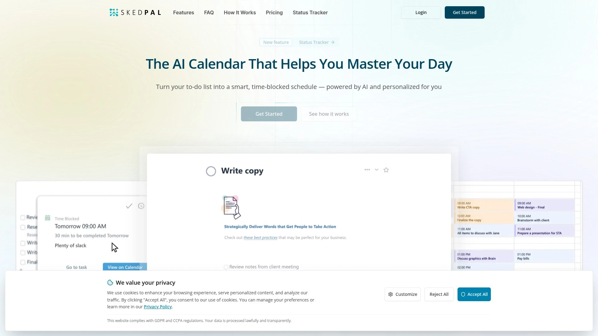

SkedPal根据优先级、截止日期和时间偏好自动安排任务。你定义可用性和任务重要性,SkedPal动态地将所有内容安排到日历中。当新任务或冲突出现时,它还会重新调整日程。

支持智能时间映射、优先级驱动规划、重复任务自动化和动态重新安排。可以按专注区域、能量水平或情境对任务分组,系统构建最佳计划。基于优先级、时间偏好和可用性的AI自动调度,用于批处理和基于情境调度的智能时间映射。

支持深度工作和能量感知规划。与Asana、Zapier、Google日历、Outlook日历和iCloud日历集成。月费14.95美元。

缺点包括日历变化时的动态重新规划可能感觉不可预测,由于高级功能学习曲线较陡。没有原生团队或协作工具,相比新工具界面可能感觉过时,第三方集成有限。

## **[Dola](https://www.heydola.com)**

通过即时消息进行对话式日历管理的AI助手。

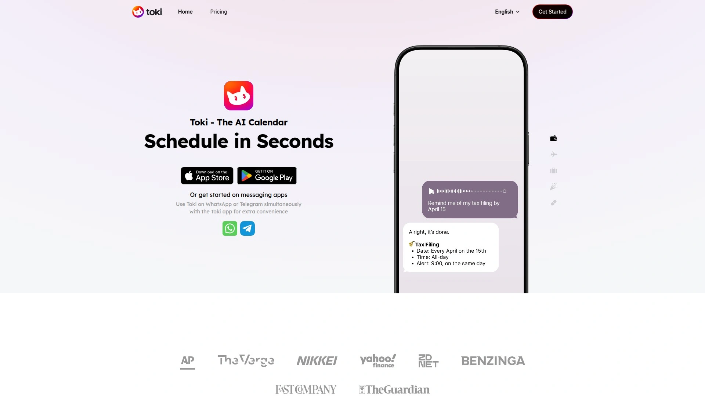

Dola是一个AI日历助手,允许用户通过自然语言对话管理个人和群组日历。通过WhatsApp、iMessage和微信等消息平台访问,Dola使用户只需聊天即可添加、删除、修改和搜索日历事件。

支持通过语音消息、文本和图像输入,使调度任务更快更直观。额外功能包括每日天气报告和聊天内网页搜索功能,增强用户准备度和便利性。

允许通过对话语言进行事件管理,简化调度流程。在流行的消息应用程序内运行,无需额外下载。接受语音、文本和图像输入用于事件创建和提醒。与Google Calendar、Apple Calendar和CalDAV无缝同步。提供每日天气报告和聊天内网页搜索,增强每日规划。

完全免费。依赖第三方消息应用程序,可能不适合喜欢独立应用程序的用户。通过消息应用程序管理日历数据可能引发一些用户的安全考虑。需要稳定的互联网连接以实现最佳性能和同步。

## **[Notion](https://www.notion.so)**

全能工作空间,将文档、数据库、任务和知识管理融为一体。

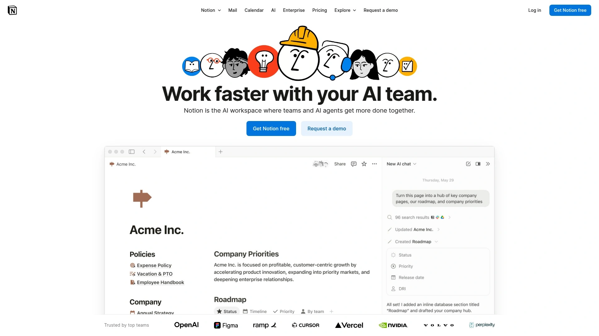

Notion是一个灵活的协作平台,让团队和个人可以在一个地方创建笔记、管理任务、构建数据库和组织知识。它以积木式的页面结构著称,你可以嵌入待办清单、看板、日历、表格等多种视图。

对于任务管理而言,Notion提供可自定义的数据库,支持多种视图切换,比如看板视图适合可视化项目阶段,日历视图便于追踪截止日期。你可以为任务添加属性如优先级、负责人、标签和关联页面,构建适合自己工作流的系统。

Notion的强大之处在于其灵活性和可扩展性。除了任务管理,它还能作为团队wiki、项目文档库、会议笔记中心,甚至个人日记本。通过模板库,你可以快速启动各种类型的工作区。

平台支持实时协作,团队成员可以同时编辑同一页面,添加评论和提及。移动应用使得随时随地访问和更新内容成为可能。与Slack、Google Drive、Figma等工具的集成进一步增强了其作为中央工作中心的能力。

提供免费个人版,团队版和企业版有更多高级功能。对于初学者,Notion的学习曲线可能有些陡峭,但一旦掌握,其灵活性将带来巨大的生产力提升。

## **[Todoist](https://todoist.com)**

简洁强大的任务管理器,以快速捕获和智能组织见长。

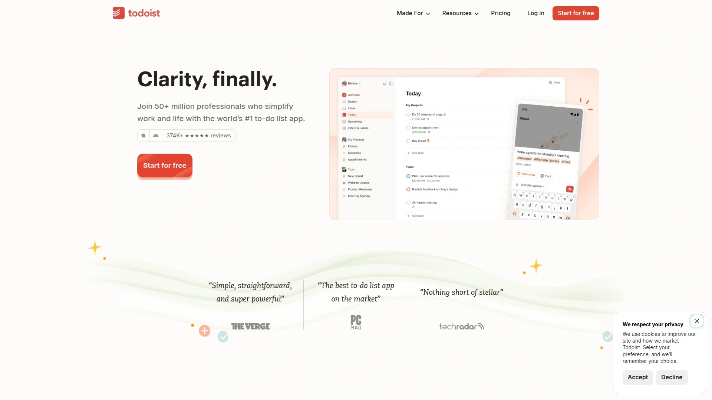

Todoist是最受欢迎的任务管理应用之一,以其简洁直观的界面和跨平台无缝同步而闻名。它采用项目、标签和优先级的组织方式,让你快速捕获想法并有序管理任务。

自然语言输入是Todoist的亮点功能,你可以输入"明天下午3点和李明开会"这样的句子,系统会自动解析出时间、日期并创建任务。重复任务设置灵活,支持复杂的循环模式如"每个工作日"或"每月最后一个周五"。

生产力视图帮助你追踪完成的任务数量和连续完成天数,通过游戏化机制激励你保持高效习惯。任务优先级用颜色标识,让你一眼看出哪些事项最紧急。评论功能支持在任务下添加附件和笔记,便于记录上下文信息。

Todoist与超过80个应用集成,包括Google Calendar、Slack、Amazon Alexa等,让任务管理融入你现有的工作流。提供免费版本,专业版每月约4美元解锁提醒、标签和文件上传等功能。商业版支持团队协作和任务委派。

适合追求简单高效、不需要复杂项目管理功能的个人用户和小团队。如果你想要更深度的项目规划和数据库功能,可能需要考虑其他工具。

## **[ClickUp](https://clickup.com)**

功能全面的项目管理平台,从任务追踪到文档协作一应俱全。

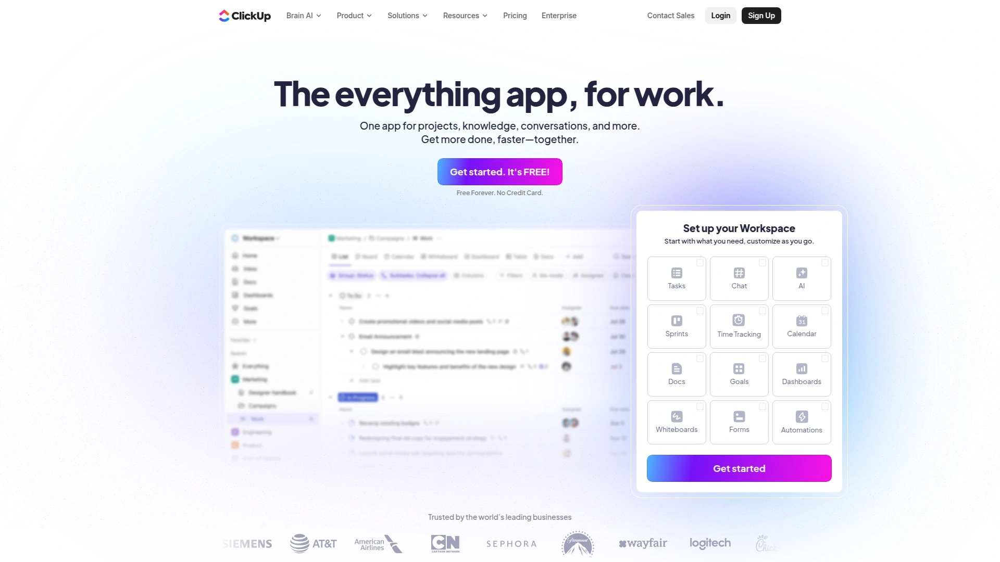

ClickUp定位为"替代所有工具的一个应用",提供任务管理、文档、目标追踪、时间追踪、白板和聊天等功能。它的核心优势在于高度可定制性,你可以根据团队需求调整视图、字段和工作流。

任务可以通过列表、看板、甘特图、日历、时间线等15种以上的视图展示。每个任务支持添加子任务、清单、自定义字段、附件和依赖关系。自动化功能强大,可以设置当任务状态改变时自动分配给特定成员或发送通知。

ClickUp Docs提供协作文档编辑,可以直接嵌入到项目工作流中。目标功能让团队可以设定OKR并追踪进度。仪表板可视化提供项目健康度、工作量分布和时间追踪数据的实时洞察。

与Slack、GitHub、Zoom、Google Drive等1000多个应用集成。通过Zapier连接Todoist实现快速任务输入。移动应用功能完善,支持离线工作。

提供永久免费版本,付费计划从每用户每月5美元起。对于新用户,ClickUp的功能丰富度可能带来一定学习成本,但对于需要全面项目管理解决方案的团队来说,它的投资回报率很高。

## **[Asana](https://asana.com)**

企业级项目管理工具,擅长跨团队协作和工作流标准化。

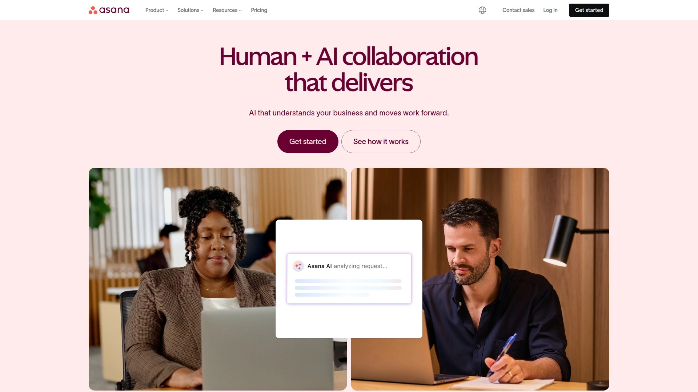

Asana是为团队设计的工作管理平台,帮助组织、追踪和管理从日常任务到战略性项目的各种工作。它以清晰的任务层级和强大的项目视图而闻名,适合中大型团队。

项目可以通过列表、看板、时间线(甘特图)和日历视图管理。任务支持子任务、依赖关系、里程碑和自定义字段,让复杂项目的规划变得结构化。工作流构建器允许你为不同项目类型创建标准化流程。

组合功能让领导层可以在单一视图中监控多个项目的进展和资源分配。工作量管理帮助团队领导了解成员的任务负荷,避免过度分配。表单功能将请求收集标准化,自动转化为项目任务。

Asana与Slack、Microsoft Teams、Zoom、Salesforce等200多个应用集成。自动化规则减少重复性手动工作,比如当任务完成时自动移动到下一阶段。报告功能提供项目状态、团队带宽和目标进度的实时仪表板。

提供基础免费版,高级版每用户每月10.99美元起,提供时间线视图、高级搜索和管理控制台。商业版和企业版增加了组合、工作量和高级集成功能。适合需要清晰责任分配和跨部门协作的成长型公司。

## **[Monday.com](https://monday.com)**

视觉化工作操作系统,通过彩色看板让项目管理变得直观。

Monday.com是一个直观的工作管理平台,以其色彩丰富、视觉化的界面而独树一帜。它让团队能够在一个中央平台上规划、追踪和交付任何类型的工作。

工作面板是Monday.com的核心,采用可定制的列和行结构。每个项目可以包含多个视图:主表、看板、甘特图、日历、地图视图等。状态列用颜色编码,一眼就能看出任务进展。时间线视图直观展示项目依赖关系和关键路径。

自动化功能简化重复性工作,通过"当-那么"逻辑设置触发器和行动。集成中心连接40多个工具,包括Slack、Zoom、Gmail、Excel等。仪表板将来自多个面板的数据聚合为可视化图表,为决策提供洞察。

模板库涵盖营销活动、产品开发、销售管道、活动策划等多种场景。移动应用功能完整,支持推送通知和离线访问。协作功能包括@提及、文件共享和更新日志。

提供免费的个人版,标准版每席位每月8美元起(年付),专业版每月12美元增加时间追踪和客户集成。企业版提供高级安全和支持。适合重视视觉化管理和快速上手的团队,特别是非技术背景的营销、创意和运营团队。

## **[Trello](https://trello.com)**

基于看板的轻量级项目管理工具,以简单易用著称。

Trello采用看板(Kanban)方法论,通过卡片、列表和面板的直观结构管理任务和项目。它的核心理念是让工作流可视化,适合喜欢简单明了的团队。

每个面板代表一个项目或工作区,列表通常代表工作流阶段(如"待办""进行中""已完成"),卡片则是具体任务。你可以在卡片中添加描述、检查清单、截止日期、附件、标签和成员。拖放操作让任务在不同阶段间的移动变得流畅。

Power-Ups是Trello的增强插件,提供日历视图、自定义字段、投票、时间追踪等额外功能。Butler自动化工具允许创建规则、按钮和命令来自动执行常规操作。团队视图提供跨多个面板的任务概览。

与Slack、Google Drive、Dropbox、GitHub等集成。移动应用体验流畅,支持离线编辑。模板库提供各种场景的预设面板,从敏捷冲刺到内容日历都有。

提供永久免费版本,标准版每用户每月5美元提供无限Power-Ups和高级清单。高级版每月10美元增加面板视图和管理功能。适合小团队、自由职业者和喜欢视觉化工作流的任何人。如果需要复杂的项目管理功能,可能需要考虑更强大的工具。

## **[Timestripe](https://timestripe.com)**

生活规划工具,从长期愿景到日常任务的时间跨度管理。

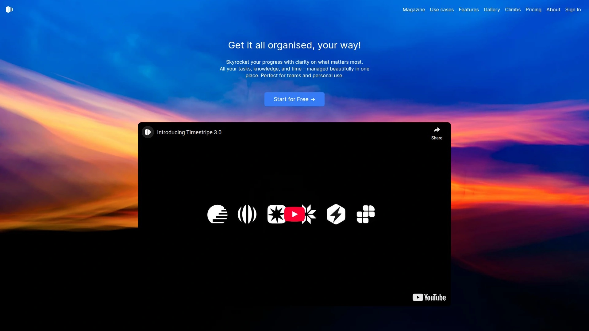

Timestripe采用独特的时间跨度视角,让你在单一界面中查看和规划今天、本周、本月、本年甚至未来5-10年的目标和任务。这种设计帮助你将远大理想与日常行动连接起来。

时间线视图将任务按时间跨度组织,你可以将长期目标分解为短期里程碑,再进一步细化为今日待办。拖放功能让任务在不同时间跨度间移动变得简单,当你完成今日任务后,可以从本周或本月池中拉取新任务。

任务支持标签、笔记和子任务,帮助你记录上下文和进度。习惯追踪功能让你设定日常或每周习惯并监控连续完成情况。反思功能鼓励你定期回顾进展,调整优先级。

Timestripe强调工作生活平衡,通过能量管理功能帮助你识别高效时段。清爽的界面设计减少干扰,让你专注于真正重要的事情。移动应用与桌面同步,随时随地访问你的规划。

提供免费版本和专业版订阅。适合注重目标导向、希望将长远规划与日常执行结合的个人用户。如果你正在寻找帮助你平衡短期紧急任务和长期人生目标的工具,Timestripe值得尝试。

## **[Routine](https://www.routine.co)**

键盘优先的快速任务捕获工具,融合日历和待办清单。

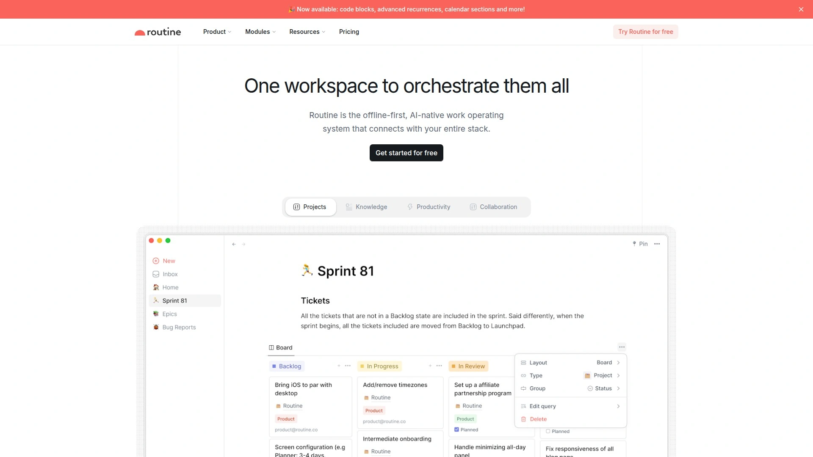

Routine是一个轻量级的任务和日历应用,专为追求速度和简洁的用户设计。它的核心理念是快速捕获想法和任务,然后通过拖拽安排到日历中。

键盘快捷键是Routine的灵魂,你可以通过全局快捷键从任何应用快速打开Routine并添加任务。自然语言输入支持快速设置截止日期和时间。控制台视图列出所有待处理任务,你可以轻松筛选和排序。

日历集成将你的会议和时间块统一显示,任务可以直接拖入空闲时段实现时间阻塞。时间块助手建议你何时安排特定任务。页面功能让你为项目或主题创建笔记和任务集合。

自动化程度较低,Routine更强调给你控制权。没有移动应用,主要面向桌面工作流。完全免费使用,适合独立创作者和小型团队。

简洁的界面和快速的操作让Routine成为那些不想被复杂功能淹没、只需要高效捕获和安排任务的用户的理想选择。如果你追求极简主义和键盘工作流,Routine值得一试。

## **[Any.do](https://www.any.do)**

生活化的任务管理应用,结合待办、日历和提醒功能。

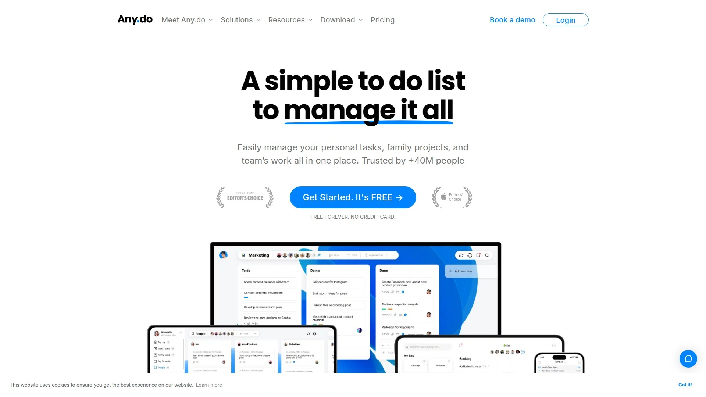

Any.do是一款注重日常生活管理的任务应用,界面友好,操作直观。它将待办事项、日历事件和提醒整合在一个平台上,帮助你管理工作和个人生活。

"今天"视图是Any.do的核心,每天早晨会提示你规划当天任务。任务可以按今天、明天、即将到来和未来分类,快速添加和重新安排。语音输入功能让你通过语音快速创建任务和提醒。

日历视图将任务和事件并列显示,帮助你看到完整的一天安排。与家人或团队成员共享列表,协作完成购物清单或项目任务。位置提醒在你到达特定地点时通知你,比如在超市时提醒购物清单。

与Alexa、Google Assistant、Siri和WhatsApp集成,多种方式添加任务。标签和子任务帮助组织复杂项目。附件支持让你在任务中添加文件和照片。

提供免费版本,高级版每月约5美元解锁无限附件、位置提醒和颜色主题。跨平台支持iOS、Android、网页、Chrome扩展和桌面应用。适合需要简单易用的个人任务管理器,特别是重视移动体验的用户。

## **[Toggl Track](https://toggl.com/track)**

自动化时间追踪工具,精准记录工作时间分布。

Toggl Track是市场上最受欢迎的时间追踪应用之一,以其用户友好的界面和强大的报告功能著称。它帮助个人和团队准确记录在各项任务上花费的时间,提升生产力和项目盈利能力。

一键启动/停止计时器让时间追踪变得轻松。日历集成自动将日历事件转换为时间条目。后台追踪功能监控你使用的应用程序和网站,稍后可将活动转换为时间条目用于报告。空闲检测在你电脑闲置时提示,帮助你修正记录,保持高精度。

番茄工作法设置让你专注工作一段时间后自动提醒休息。自定义仪表板显示每周统计或团队摘要。报告功能支持按团队、标签或客户筛选,生成详细的数据分析。可设置每用户、项目或任务的费率,监控实际成本与可计费时间。

与100多个应用集成,包括Asana、Jira、Slack、Notion、Google Sheets等。Chrome和Firefox扩展直接在其他应用中嵌入Toggl计时器,无需切换标签。移动应用支持离线追踪,联网后自动同步。

免费支持最多5个用户,包括无限追踪和项目。入门版每用户每月9美元(年付)增加时间舍入、计费费率和保存的报告。不含屏幕截图或按键追踪,注重隐私。适合自由职业者、咨询公司和任何需要准确时间记录的专业人士。

## **[RescueTime](https://www.rescuetime.com)**

自动生产力追踪器,帮助你了解时间花费并阻止干扰。

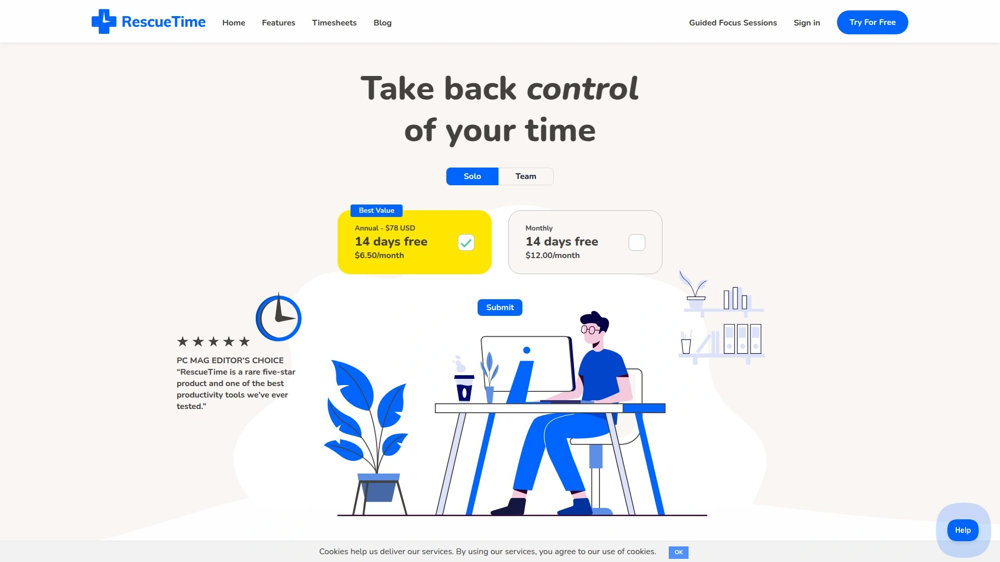

RescueTime在后台自动运行,追踪你在应用程序和网站上花费的时间,无需手动启动计时器。它生成详细报告,显示你的时间分配,帮助识别生产力模式和干扰源。

生产力评分功能根据你标记的应用和网站类别(生产性vs干扰性)计算每日得分。FocusTime会话模式阻止分散注意力的网站一段时间,帮助你进入深度工作状态。目标设置让你为特定活动(如编程或写作)设定每日或每周时间目标。

每日和每周报告通过电子邮件发送,总结你的生产力趋势。警报在你在干扰性网站上花费过多时间时通知你。时间表自动生成,可用于计费或项目管理。

与Slack、Zapier等集成。离线时间追踪支持,稍后同步。隐私模式让你在需要时暂停追踪。

提供免费版本,显示基本生产力数据。高级版每月约12美元解锁FocusTime、详细报告和目标。适合希望了解自己时间使用习惯、减少干扰并建立更好工作习惯的个人用户。注重自动化,最小化手动输入,让你专注于工作而非追踪。

## **[Fantastical](https://flexibits.com/fantastical)**

高级macOS和iOS日历应用,以优雅设计和自然语言输入闻名。

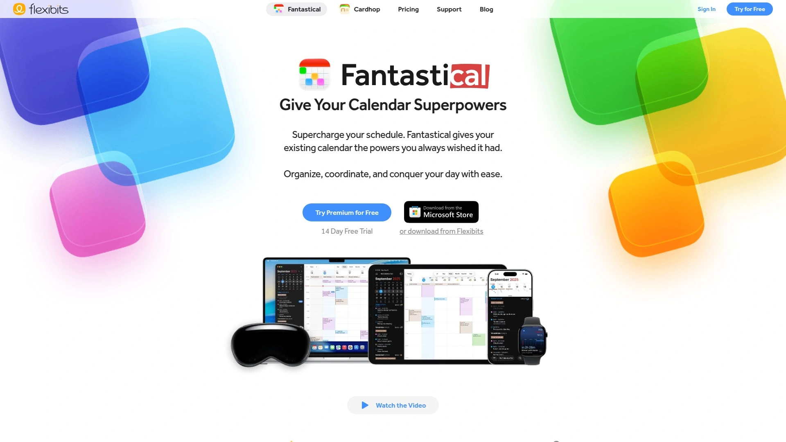

Fantastical是Apple生态系统中的旗舰日历应用,提供比原生Apple Calendar更丰富的功能和更精致的设计。它深度集成iCloud、Google、Outlook和Exchange日历,在单一界面中统一管理。

自然语言事件创建是其标志性功能,你可以输入"明天下午3点与张伟在星巴克见面1小时"这样的句子,Fantastical会自动解析并创建事件。事件模板让你保存常用会议设置,快速创建重复性事件。

支持30多种视频会议服务(Zoom、Teams、Meet等),一键添加会议链接。日历集和专注过滤器帮助你根据情境(工作、个人、项目)切换视图。时区支持对于跨国团队特别有用,自动处理时区转换。

天气预报集成在日历视图中显示,帮助你规划户外活动。任务管理通过Todoist集成实现,将待办事项与日历事件并列。Apple Watch应用提供手腕上的快速访问和通知。

需要订阅才能使用,提供免费试用。年订阅费用约56美元。仅支持macOS、iOS和Apple Watch平台。适合深度投入Apple生态系统、追求高级功能和优雅设计的用户。如果你需要跨平台支持或免费解决方案,Google Calendar可能更合适。

## **[Taskade](https://www.taskade.com)**

实时协作工作空间,融合任务、笔记、视频聊天和思维导图。

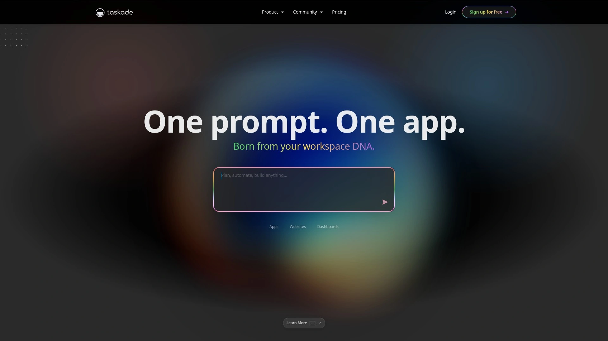

Taskade是一个多功能协作平台,将项目管理、笔记和团队沟通整合到一个简洁界面中。它特别适合小团队和远程协作。

项目可以用列表、看板、表格、思维导图和组织结构图等多种视图展示。你可以为项目选择图标和颜色,或上传自定义图像。块级自定义让你为每个内容块选择不同的格式,这是其他工具少见的灵活性。

实时协作支持多人同时编辑同一项目,类似Google Docs。内置视频聊天让团队可以在项目中直接交流,无需切换应用。评论功能方便在任务上进行讨论。

任务可以添加截止日期、分配给成员、添加标签。日历同步将任务显示在你的日历中。模板库提供各种项目起点,从会议议程到产品路线图。

与Zoom、Slack、Google Calendar等工具集成。自然语言任务输入加快创建速度。键盘快捷键和命令栏提升效率。

提供永久免费版本,专业版提供更多存储和高级功能。跨平台支持网页、桌面、iOS和Android。适合需要轻量级但功能完整的远程团队协作工具的小团队。如果你在寻找Trello、Asana和Monday.com的简化替代品,Taskade值得考虑。

## **[Google Calendar](https://calendar.google.com)**

全球最流行的免费日历服务,与Google生态深度集成。

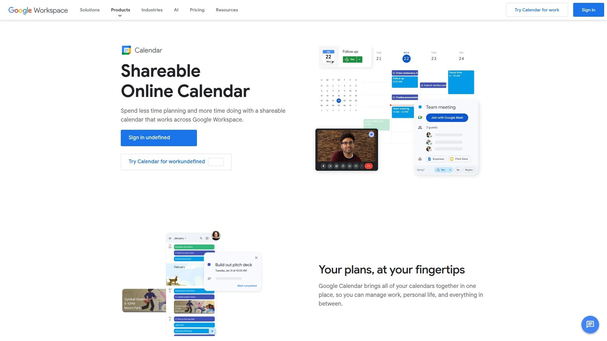

Google Calendar是大多数人日程管理的起点,提供可靠、免费且功能全面的日历服务。它与Gmail、Google Meet、Google Drive等Google服务原生集成,创造无缝工作流。

事件创建简单直观,从Gmail中自动提取航班、酒店和活动预订信息并添加到日历。智能事件建议根据你的历史数据推荐最佳会议时间。多个日历支持让你分离工作、个人和其他类别,选择性显示。

共享日历让团队成员查看彼此可用性,简化会议安排。Google Meet视频会议一键添加到事件中。工作时间设置和焦点时间功能帮助保护深度工作时段。

与数百个第三方应用集成,通过Chrome扩展和附加组件扩展功能。Google Workspace管理员可以为组织设置共享日历和访问权限。移动应用在Android和iOS上提供完整功能。

完全免费使用,包括无限存储和事件。虽然界面相对简单,缺少高级功能如事件模板或深度自定义,但其可靠性和广泛兼容性使其成为默认选择。适合所有需要基础到中等日历功能、重视跨平台访问和Google生态集成的用户。

---

## 常见问题

**如何选择适合自己的AI日程规划工具?**

选择时应考虑你的工作方式和具体需求。如果你喜欢完全自动化,Motion和Reclaim.ai会自动安排任务;如果你偏好手动控制,Sunsama和Trevor AI提供更多自主权。评估工具是否与你现有的工作流集成,比如Notion、Todoist或Google Calendar。考虑预算,许多工具提供免费版本或试用期,先测试再决定。

**AI日程规划工具真的能提高效率吗?**

研究显示合理规划可显著提升生产力。工作者每天因糟糕的日程安排和干扰浪费多达2小时,而每天仅10-12分钟的规划就能节省2小时并提升25%的生产力。AI工具通过自动化重复性决策、优化任务排序和保护专注时间,让你将精力放在执行而非后勤上。效果取决于你输入数据的质量和遵循建议的程度。

**这些工具适合团队使用还是仅限个人?**

大多数工具既支持个人也支持团队使用,但侧重点不同。Motion、Reclaim.ai和Clockwise提供团队协作功能如共享日历和工作量管理。Asana、ClickUp和Monday.com更侧重团队项目管理。BeforeSunset AI、Todoist和Any.do更适合个人效率提升。选择时确认工具的协作功能是否满足你的团队规模和沟通需求。

---

## 结语

在这份全面的汇总中,我们探索了23款优秀的AI日程规划和时间管理工具,每一款都有其独特优势和适用场景。从全自动化的Motion到注重正
